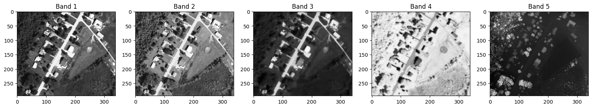
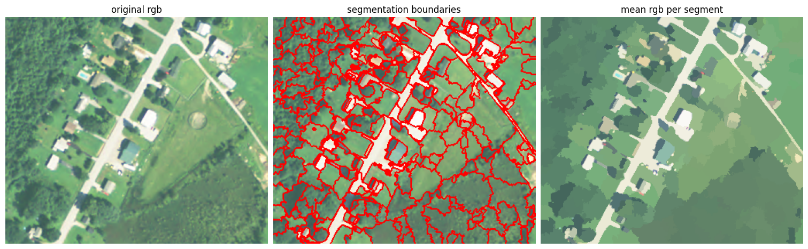
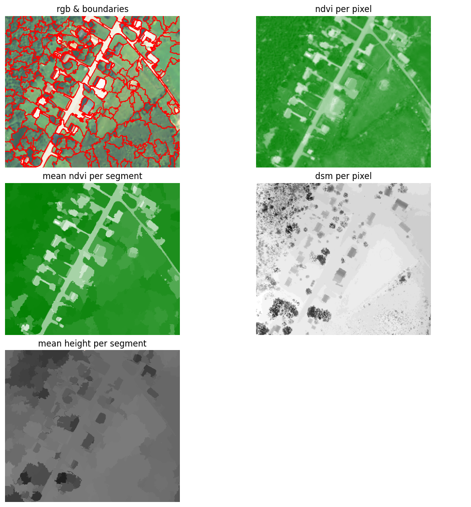
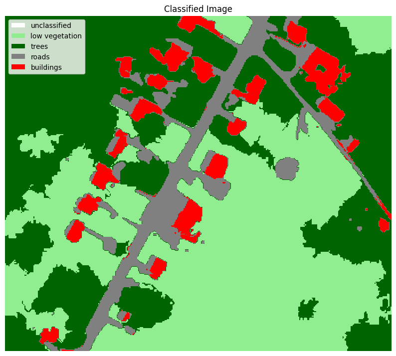

# Object Based Image Analysis (OBIA) with Python

_August, 2023_ 

Authors: [Candela Sol Pelliza](https://candelasolpelliza.com/) & [Rodrigo Brust Santos](rodrigobrust.com)

Application Development (Object-Based Image Analysis)
    
- Dr. Prof. Dirk Tiede & Dr. Prof Martin Sudmanns

# Table of Contents

1. [Introduction](#introduction)
2. [Objectives](#objectives)
3. [Results](#results)
4. [References](#references)

___ 

## Introduction

This repository is the development of the final project for Application Development lecture. 

In the Remote Sensing industry, OBIA is a technique that aims to utilize objects instead of pixels when analyzing an image. 

From a satellite scene, one must segment pixel values in groups with similar values, following up for the classification. 

It is a powerful approach, since it is fiasible to utilize several bands and rasters, such as the regular RGB but also DEM and DSM, leading to more reliable classification - and avoiding salt-peper effect.

## Objectives

In the EO*GI industry, there are a lot of softwares and resources that are very convinient, however an expensive subscription is necessary. Also, finding a good OBIA workflow is an exhausthing process. 

Having that in mind, this project has two main objectives: 

1 - Apply the concepts of OBIA with Python on a 5-band-scene, using R, G, B, and NIR bands in addition to a DSM.

- Classify high/low vegetation, road and houses based on NDVI and height.

- Export classified segments to geojson.

2 - Provide a resource for students and industry players from an open-source software.

## Results

To achieve the result, there were a couple of steps: 

1 - Segment the image with scikit-image quickshift algorithm.

2 - Create the mean of rgb for each object

3 - Calculate the mean NDVI and Height for each object

4 - Create rules and assign classes

- In total, there were 5 classes: `unclassified`, `low vegetation`, `trees`, `roads` and `buildings`.

5 - Generate the classified image 

## References

- [Tips for GIS - DEM Raster Analysis](https://github.com/TipsForGIS/dem-raster-analysis/blob/master/dem.ipynb)

- [OBIA Tutorials by fkroeber](https://github.com/fkroeber/obia_tutorials)

- [Open Source Options - OBIA](https://opensourceoptions.com/blog/python-geographic-object-based-image-analysis-geobia/)

- [OBIA Land Cover Classification With Python](https://towardsdatascience.com/object-based-land-cover-classification-with-python-cbe54e9c9e24)

- [Intro Raster: Fundamentals for Raster with Python](https://www.earthdatascience.org/courses/use-data-open-source-python/intro-raster-data-python/fundamentals-raster-data/open-lidar-raster-python/)
